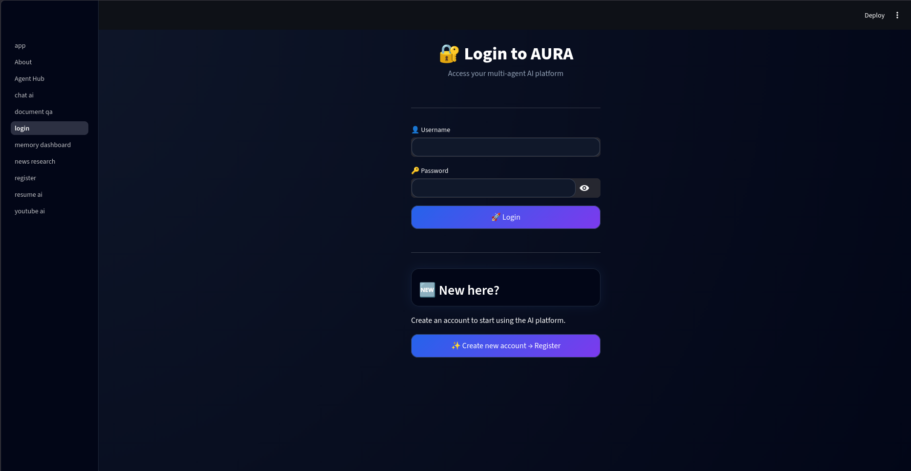
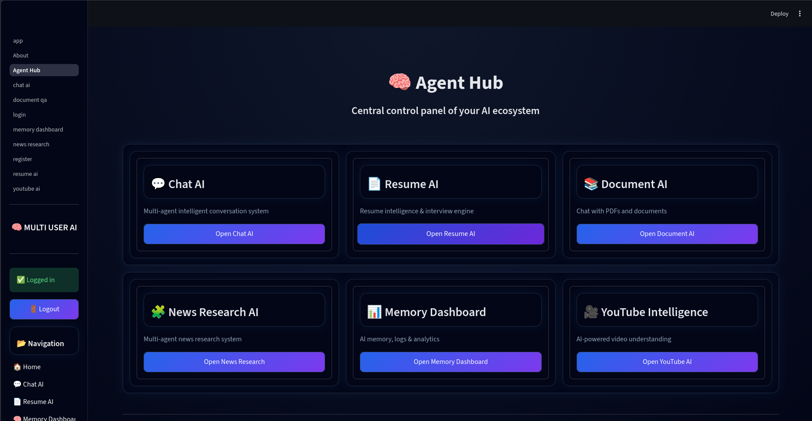
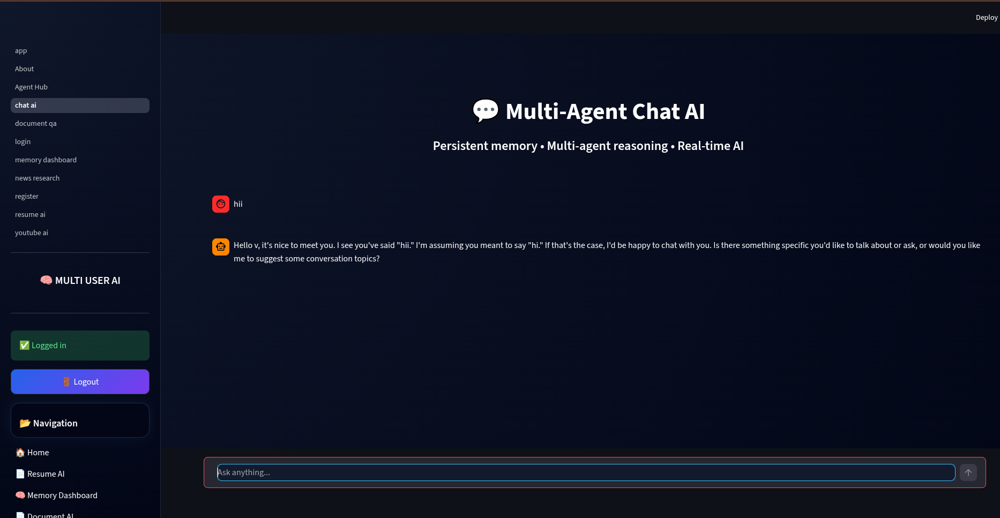
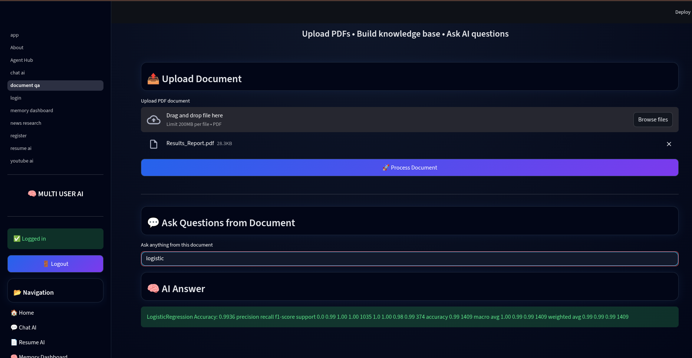
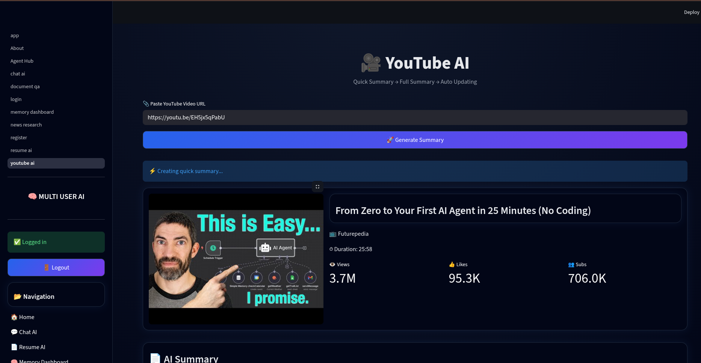
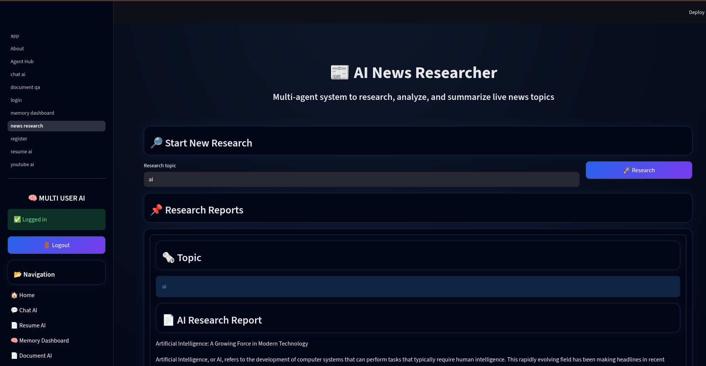
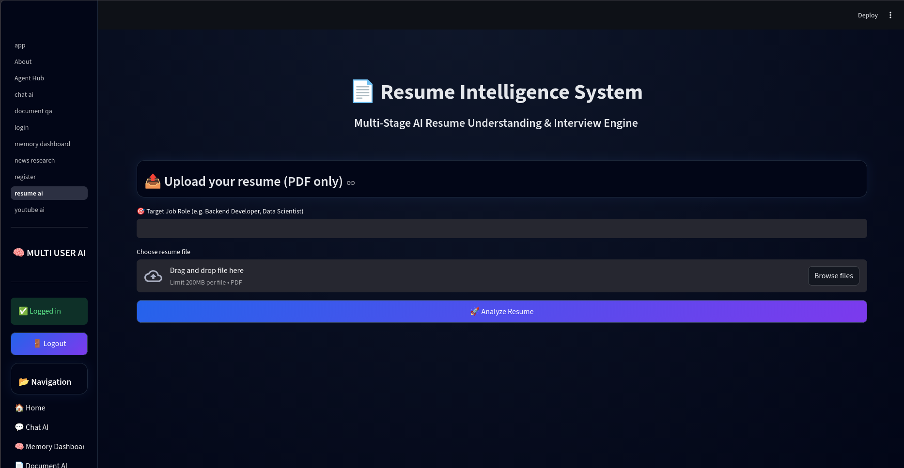
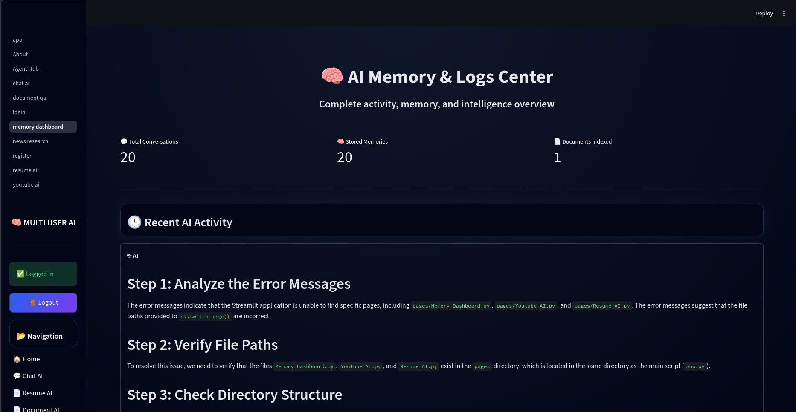

# AURA AI — Multi User AI Platform

AURA AI is a full-stack AI-powered multi-user platform built using modern AI infrastructure, secure authentication, and modular backend architecture.

The platform provides AI-powered tools for:

- Conversational AI
- YouTube Video Analysis
- Document Question Answering
- News Research & Summarization
- Resume Intelligence
- User Memory Management

---

## Tech Stack

### Backend

- FastAPI
- MongoDB
- Groq (LLaMA 3.1)
- YouTube Data API v3
- Faster-Whisper
- JWT Authentication
- SMTP Email System
- Argon2 Password Hashing

### Frontend

- Streamlit
- ReportLab (PDF Export)
- Custom Glass UI

---

## Features

### Authentication

- Email OTP Verification
- JWT Login Authentication
- Secure Protected Routes
- Multi-User Session Isolation
- Argon2 Password Hashing

### Chat AI

- Groq Powered LLaMA 3.1 Chat
- Persistent Memory Storage
- Per-User Conversation History

### YouTube AI

- Instant Quick Summary
- Detailed Background Summary
- Metadata Display
- Transcript Toggle
- PDF Export
- Audio Upload Fallback
- Whisper Transcription

### Document AI

- PDF Upload Support
- Contextual Question Answering
- Vector Search using FAISS

### News Research AI

- Web Scraping
- AI Summarization
- Context-Aware Research

### Resume AI

- Resume Analysis
- Intelligent Feedback
- AI-Powered Processing

### Memory Dashboard

- View Stored Interactions
- Per-User Data Isolation
- Memory Management

---

## Project Structure

```text
AURA_AI/
│
├── backend/
│   ├── main.py
│   ├── core/
│   ├── db/
│   ├── modules/
│   └── requirements.txt
│
├── frontend/
│   ├── app.py
│   ├── pages/
│   └── components/
│
├── images/
│
└── README.md
```

---

## Installation Guide

### 1. Clone Repository

```bash
git clone https://github.com/vivekkk06/AURA_AI.git
cd AURA_AI
```

---

### 2. Backend Setup

#### Linux / macOS

```bash
python3 -m venv venv
source venv/bin/activate
```

#### Windows

```bash
python -m venv venv
venv\Scripts\activate
```

Install dependencies:

```bash
pip install -r requirements.txt
```

---

### 3. Environment Variables

Create a `.env` file inside `backend/`

```env
GROQ_API_KEY=your_groq_key
YOUTUBE_API_KEY=your_youtube_key
MONGO_URL=mongodb://localhost:27017
SECRET_KEY=your_secret_key

EMAIL_HOST=smtp.gmail.com
EMAIL_PORT=587
EMAIL_USER=your_email@gmail.com
EMAIL_PASSWORD=your_app_password
```

Use a Gmail App Password instead of your real Gmail password.

---

### 4. Run Backend

```bash
uvicorn main:app --reload
```

Backend URL:

```text
http://127.0.0.1:8000
```

---

### 5. Frontend Setup

```bash
cd frontend
python -m venv .venv
```

#### Linux / macOS

```bash
source .venv/bin/activate
```

#### Windows

```bash
.venv\Scripts\activate
```

Install packages:

```bash
pip install streamlit requests reportlab
```

Run frontend:

```bash
streamlit run app.py
```

Frontend URL:

```text
http://localhost:8501
```

---

## Required External Tools

### yt-dlp

```bash
pip install yt-dlp
```

### FFmpeg

#### Fedora

```bash
sudo dnf install ffmpeg
```

#### Ubuntu

```bash
sudo apt install ffmpeg
```

#### macOS

```bash
brew install ffmpeg
```

#### Windows

Download from:

https://ffmpeg.org/download.html

Add FFmpeg to your system PATH.

---

## Screenshots

<p align="center">
  
  
</p>

<p align="center">
  
  
</p>

<p align="center">
  
  
</p>

<p align="center">
  
  
</p>

---

## Security

Implemented security measures:

- JWT Authentication
- Environment-Based Secret Management
- Secure Password Hashing
- Protected API Access
- MongoDB ObjectId Protection
- Repository Credential Isolation

---

## Author

**Vivek Badgujar**

GitHub: https://github.com/vivekkk06

---

## License

Built for educational and portfolio purposes.